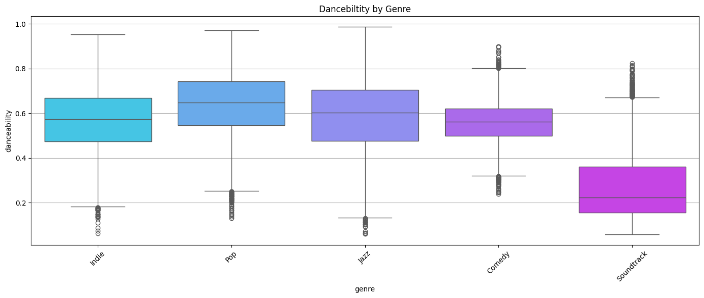
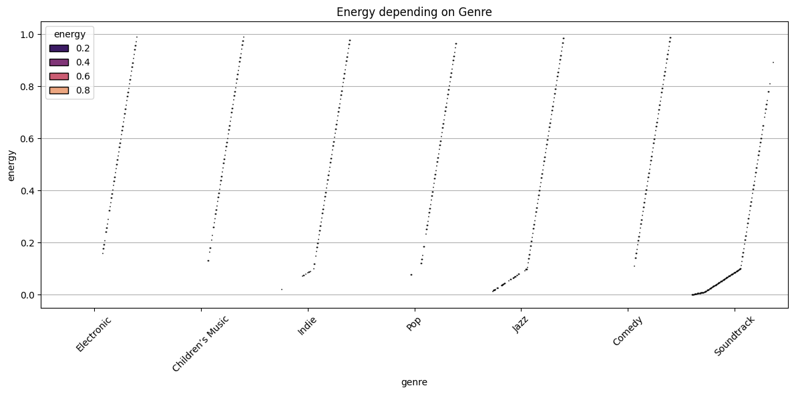
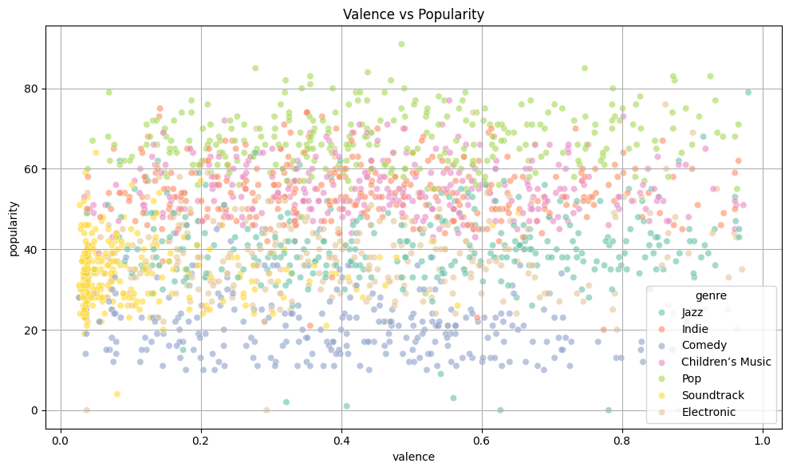
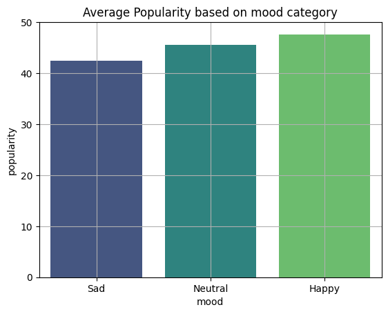
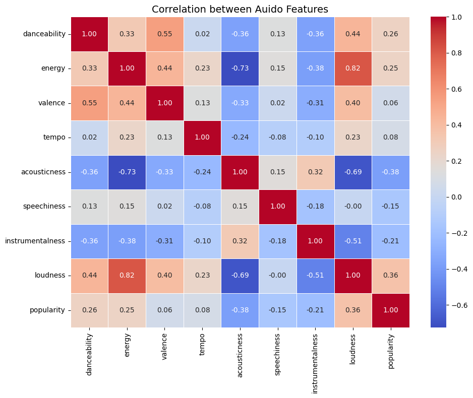
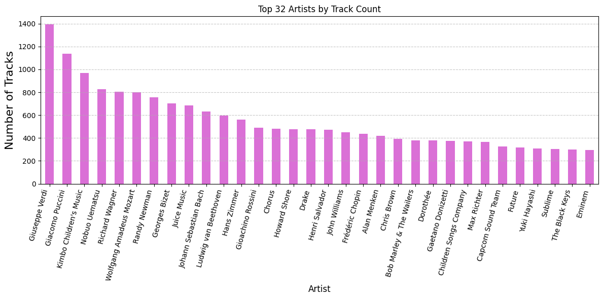
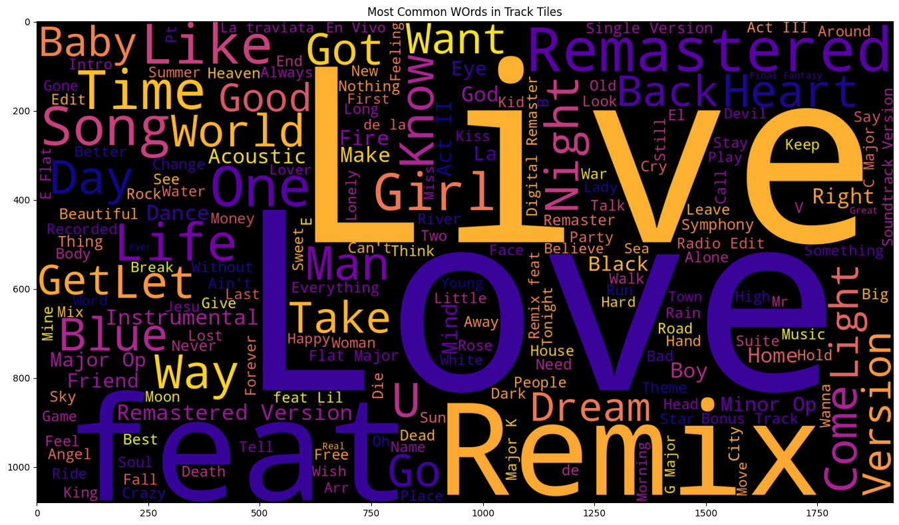

# 🎧 Spotify Music Analysis — Mood, Genre & Popularity

Ever wondered if sad songs are secretly topping charts?  
Or which genre makes people dance harder than others?

This project dives into thousands of Spotify tracks using `pandas`, `seaborn`, and `wordcloud`, exploring how mood, genre, and features like danceability or energy shape music trends.

---

## 📊 What’s Inside

### 🎭 Danceability by Genre  
Which genres get people moving?

---

### 🔋 Energy by Genre  
Genres with the highest intensity and hype.

---

### 😌 Valence vs Popularity (Scatter)  
Trying to figure out if happy songs are more popular.  
I failed lol. It was messy af, so I bar-plotted the mood instead ☹️

---

### 😐 Average Popularity by Mood  
Turns out neutral mood songs are secretly kings. Sad and happy? Meh.

---

### 🔥 Correlation Between Audio Features  
What features go hand-in-hand? Energy and loudness? Yup.  
Acoustic vs Energy? Enemies. 👀

---

### 🎤 Top 50 Artists  
Who’s spamming Spotify the hardest?

---

### ☁️ Most Common Words in Track Names  
Yes, “love” still dominates.  
Also “remix”, “feat”, and “tonight” be lurking.

---

## 📂 Files

- `notebook/spotify_analysis.ipynb` → Your main code notebook  
- `assets/` → All graphs and visualizations exported as `.png`  
- `README.md` → This beautiful file  
- *(optional)* `requirements.txt` → Add for reproducibility

---

## 🏷️ Tech Stack

`Python`, `pandas`, `matplotlib`, `seaborn`, `wordcloud`, `nltk`

---

## 🔖 Tags

`#EDA` `#DataScience` `#SpotifyAnalysis` `#Python` `#MusicTrends` `#Visualization` `#Pandas` `#Seaborn`

---

## 📌 Inspiration

This was a personal project aimed at exploring audio feature trends in Spotify data,  
understanding the emotional landscape of music, and creating portfolio-ready visual storytelling.

---

## 📡 Let’s Connect

Let’s collab, roast charts, or jam to bad song titles together.  
DM me here or find me on [LinkedIn](https://www.linkedin.com/in/ritesh-bytegenosis/) 😉

